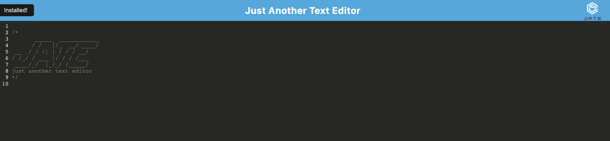

# Text-Editor

### User Story

As a user looking with a busy schedule, I would like an application that allows me to see, track, add, update, edit and delete my tasks. This will help me track and oraganize all my tasks. When I am on the homepage, I am presented with a toolbar where I can enter a new task. When I am looking at my existing tasks, I can see the To Do section, the In progress section and the completed section.
### Features
This project is a a text editor app that will run in a browser
This text editor will run with or without internet service
The text editor can be installed locally so it can be ran anytime from he users' desktop
The editor is also deployed to a hposting service wehere it can be ran as well.

### badges

## Table of Contents

- [installation](#installation)
- [contribution guidelines](#contribution)
- [Test Instructions](#testing)
- [License](#license)
- [Questions](#questions)

### Installation
Please clone the github repo here :
https://github.com/Vinyldude8896/Just_A_Text_Editor

#### Install Dependencies
The script is set up so that when you run npm start it will also build the dependancies.

#### Run the program
In the root directory run : npm start
Go to your browser location : http://localhost:3000/
Test the editor by typing in text
You can also choose to install the app using the install button and try running it from your desktop.

#### Deployed app
The live Heroku app is here:
https://justatexteditorapp.herokuapp.com

### Contribution Guidelines
N/A as of yet
### Testing
To test this app:
1. Clone the repo here : https://github.com/Vinyldude8896/Just_A_Text_Editor
2. at the root folder run the command npm start - this will build and run the server.
3. Go to http://localhost:3000/ and test the editor by typing text
4. Refresh the page and it should all reload as it saves to indexedDB
5. Install the application using the install button.
5. try typing and refreshing thr browser again.

### Questions
    email address : kevinnivek@me.com
    - additional instructions 
    I can be contacted by phone as well, but prefer email contact first.

### Images of example readme.md

